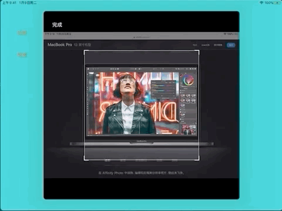

# SPClipTool
图片裁剪工具

类似iOS原生裁剪，支持图片拖拽，缩放，裁剪框自由变换大小。

## 使用

```objc
[[SPClipTool shareClipTool] sp_clipOriginImage:pickerImage complete:^(UIImage * _Nonnull image) {
    // image 裁剪后的图片
}];
```

## 效果
(加载可能比较慢 等等呗....)




